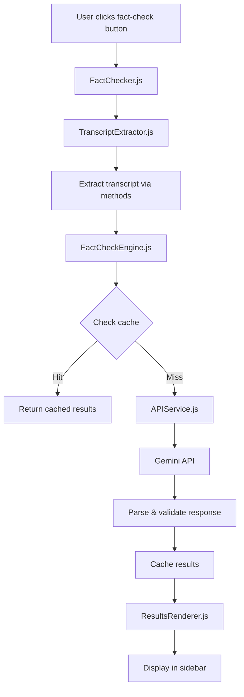
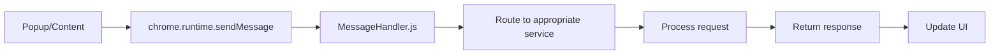

# 🏗️ YouTube Fact-Check Extension - Architecture Documentation

> **AI-powered fact-checking extension with advanced verification and real-time grounding search**

## 📁 Project Structure Overview

```
fact-check-extension-stable/
├── 📋 manifest.json                 # Extension configuration
├── 🎨 styles.css                   # Global styles
├── 📄 popup.html                   # Settings popup UI
├── 🔧 popup.js                     # Popup functionality
├── 🌐 content.js                   # Content script entry point
├── 
├── 🏢 core/                        # Core business logic (modularized)
│   ├── BackgroundService.js        # Main orchestrator service
│   ├── MessageHandler.js           # Message routing & handling
│   ├── APIService.js               # Gemini API communication
│   ├── FactCheckEngine.js          # Fact-checking processing
│   └── FactChecker.js              # Main content script controller
│   
├── 🎨 ui/                          # User interface components
│   ├── ButtonManager.js            # Fact-check button injection
│   ├── SidebarManager.js           # Results sidebar management
│   ├── ResultsRenderer.js          # Results display & formatting
│   └── StylesManager.js            # Dynamic style injection
│   
├── 📝 transcript/                  # Transcript extraction system
│   ├── TranscriptExtractor.js      # Main extraction coordinator
│   ├── methods/                    # Extraction methods
│   │   ├── HybridOfficial.js       # Official API + Innertube (95% success)
│   │   ├── InnertubeAPI.js         # Innertube with Android client (92% success)
│   │   └── UIAutomation.js         # UI automation fallback
│   └── utils/                      # Transcript utilities
│       └── Parser.js               # Text parsing utilities
│       
├── 🛠️ utils/                       # Shared utilities & configuration
│   ├── Cache.js                    # Optimized caching system
│   ├── SettingsManager.js          # Settings validation & storage
│   ├── StatsManager.js             # Usage statistics tracking
│   ├── ModelConfig.js              # AI model configurations
│   ├── Constants.js                # System constants & configuration
│   ├── DOMUtils.js                 # DOM manipulation utilities
│   └── URLObserver.js              # URL change detection
│   
└── 🖼️ icons/                       # Extension icons
    ├── icon16.png                  # 16x16 icon
    ├── icon32.png                  # 32x32 icon
    ├── icon48.png                  # 48x48 icon
    └── icon128.png                 # 128x128 icon
```

---

## 🔧 Core Architecture

### 📋 Entry Points

| **File** | **Purpose** | **Context** |
|----------|-------------|-------------|
| `manifest.json` | Extension configuration & permissions | Chrome Extension |
| `content.js` | Main content script entry point | YouTube pages |
| `popup.js` | Settings interface | Extension popup |
| `core/BackgroundService.js` | Background service worker | Service worker |

### 🏗️ Modular Design Philosophy

The extension follows a **modular architecture** with clear separation of concerns:

- **🏢 Core**: Business logic and data processing
- **🎨 UI**: User interface and interaction management  
- **📝 Transcript**: Video transcript extraction system
- **🛠️ Utils**: Shared utilities and configuration

---

## 🏢 Core Modules

### 🎯 BackgroundService.js
**Main orchestrator service worker**

```javascript
import { APIService } from './APIService.js';
import { FactCheckEngine } from './FactCheckEngine.js';
import { MessageHandler } from './MessageHandler.js';
```

**Responsibilities:**
- Service worker lifecycle management
- Module coordination and initialization
- Cache cleanup scheduling
- Extension action handling

---

### 📨 MessageHandler.js
**Centralized message routing system**

**Handles Messages:**
- `GET_SETTINGS` - Retrieve user settings
- `SAVE_SETTINGS` - Save user configuration
- `FACT_CHECK_REQUEST` - Process fact-checking requests
- `VALIDATE_API_KEY` - Verify Gemini API key
- `TOGGLE_EXTENSION` - Enable/disable extension
- `RESET_SETTINGS` - Reset to default settings

**Communication Flow:**
```
Popup/Content → MessageHandler → Core Services → Response
```

---

### 🤖 APIService.js
**Gemini AI API communication layer**

**Features:**
- Multiple model support (Gemini 2.5 Flash, 2.0 series)
- Automatic fallback system
- Rate limiting protection
- Grounding search integration (for compatible models)
- Request timeout handling

**Model Selection Logic:**
```javascript
Primary: gemini-2.5-flash-lite (grounding-enabled)
Premium: gemini-2.5-flash  
Fallbacks: gemini-2.0-flash-lite, gemini-2.0-flash
```

---

### 🔍 FactCheckEngine.js
**Advanced fact-checking processing engine**

**Processing Pipeline:**
1. **Content Analysis** - Detect content type (news, science, politics, etc.)
2. **Cache Check** - Look for existing results
3. **Prompt Generation** - Create context-aware prompts
4. **AI Processing** - Send to Gemini API with appropriate settings
5. **Result Validation** - Parse and validate AI responses
6. **Enhancement** - Add reliability scores and metadata
7. **Caching** - Store results for future use

**Content Types Supported:**
- 📰 News & Current Events
- 🔬 Scientific Content  
- 🏛️ Political Information
- 🏥 Health & Medical
- 💼 Business & Finance
- 💻 Technology
- 📊 General Content

---

### 🎮 FactChecker.js
**Main content script controller**

**Coordination Role:**
- Manages UI components (ButtonManager, SidebarManager)
- Handles transcript extraction requests
- Coordinates fact-checking workflow
- Manages extension state and settings updates

---

## 🎨 UI Components

### 🔘 ButtonManager.js
**YouTube button injection system**

**Injection Strategies:**
1. Modern YouTube layout detection
2. Like button container targeting
3. Actions container fallback
4. Menu renderer fallback

**Features:**
- Automatic re-injection on page changes
- Loading state management
- Click event handling
- Container validation

---

### 📊 SidebarManager.js
**Results display sidebar**

**States:**
- Hidden (default)
- Loading (analysis in progress)
- Results (displaying fact-check results)
- Error (showing error messages)

**Features:**
- Smooth slide-in animations
- Refresh functionality
- Close button handling
- Content area management

---

### 🎨 ResultsRenderer.js
**Fact-check results formatting**

**Rendering Components:**
- Results summary statistics
- Individual claim cards
- Evidence source details
- Reliability indicators
- Interactive expandable sections

**Status Types:**
- ✅ True (90-100% confidence)
- ✅ Mostly True (75-89%)
- ⚠️ Partly True (60-74%)
- ⚠️ Misleading (40-59%)
- ❌ False (20-39%)
- ❓ Unverifiable (0-19%)

---

## 📝 Transcript Extraction System

### 🎯 TranscriptExtractor.js
**Multi-method extraction coordinator**

**Extraction Methods (Priority Order):**
1. **HybridOfficial** (95% success rate)
2. **InnertubeAPI** (92% success rate) 
3. **UIAutomation** (Fallback)

**Features:**
- Automatic method prioritization
- Caching for performance
- Statistics tracking
- Timeout handling
- Validation and filtering

---

### 🌟 HybridOfficial.js
**Highest reliability extraction method**

**Dual Approach:**
1. **Official YouTube Data API** (when authenticated)
2. **Innertube API Fallback** (Android client impersonation)

**Authentication Methods:**
- OAuth2 tokens (if available)
- API key extraction from page
- Rate limiting protection

---

### 🔧 InnertubeAPI.js
**Innertube API with Android client**

**Technical Details:**
- Android client impersonation
- Dynamic API key extraction
- JSON3 format preference
- Automatic language detection

---

### 🎮 UIAutomation.js
**User interface automation fallback**

**DOM Interaction:**
- Transcript button detection
- Panel opening automation
- Text segment extraction
- Cleanup after extraction

---

## 🛠️ Utilities & Configuration

### 💾 Cache.js
**Optimized caching system**

**Features:**
- LRU (Least Recently Used) eviction
- Automatic expiry management
- Conditional debug logging
- Transcript-specific utilities
- Statistics and monitoring

**Cache Types:**
- Transcript cache (24h expiry)
- Fact-check results (1h expiry)
- Settings cache

---

### ⚙️ SettingsManager.js
**Configuration management**

**Settings Categories:**
- **Core**: enabled, apiKey, language
- **Processing**: usePremiumModel, useGroundingSearch, strictMode
- **Performance**: analysisTimeout, cacheResults, confidenceThreshold
- **Statistics**: videosChecked, claimsFound, accurateClaims

**Validation Features:**
- Type checking and sanitization
- Range validation for numeric values
- Language code validation
- Migration handling for updates

---

### 📊 StatsManager.js
**Usage analytics & tracking**

**Tracked Metrics:**
- Videos analyzed
- Claims identified
- Accuracy rates
- Usage patterns
- Performance metrics

---

### 🤖 ModelConfig.js
**AI model configuration**

**Model Definitions:**
```javascript
models: {
  default: 'gemini-2.5-flash-lite',
  premium: 'gemini-2.5-flash', 
  grounding: 'gemini-2.5-flash-lite',
  fallbacks: ['gemini-2.0-flash-lite', 'gemini-2.0-flash']
}
```

**Content Pattern Detection:**
- Keyword matching for content types
- Context indicators analysis
- Scoring algorithm for classification

---

### 📋 Constants.js
**System configuration & constants**

**Configuration Categories:**
- UI selectors and class names
- API endpoints and timeouts
- Error and success messages
- Performance thresholds
- Debug configuration

---

## 🔄 Data Flow Architecture

### 📥 Fact-Check Request Flow



### 🔄 Message Flow



---

## 🏆 Performance Optimizations

### ⚡ Caching Strategy
- **Transcript Cache**: 24-hour expiry for extracted transcripts
- **Results Cache**: 1-hour expiry for fact-check results
- **LRU Eviction**: Automatic cleanup of least-used entries
- **Conditional Logging**: Debug logging only when enabled

### 🚀 Loading Performance
- **Lazy Loading**: Dynamic imports for heavy modules
- **Rate Limiting**: Prevents API abuse and improves performance
- **Timeout Handling**: Prevents hanging requests
- **Cleanup Timers**: Automatic resource management

### 🎯 Memory Management
- **Event Listener Cleanup**: Proper removal on page changes
- **Cache Size Limits**: Prevents memory bloat
- **Garbage Collection**: Automatic cleanup of expired data

---

## 🛡️ Error Handling & Reliability

### 🔒 Graceful Degradation
- **Multiple Extraction Methods**: Automatic fallback system
- **API Failover**: Multiple model fallbacks
- **Silent Failures**: Non-blocking error handling
- **User Feedback**: Clear error messages and retry options

### 🔍 Debugging & Monitoring
- **Conditional Logging**: Debug mode for detailed logging
- **Performance Tracking**: Method success rates and timing
- **Error Reporting**: Detailed error context and stack traces
- **Statistics Collection**: Usage patterns and performance metrics

---

## 🚀 Extension Lifecycle

### 📋 Installation
1. **Default Settings**: Initialize configuration
2. **Permission Grants**: API access and content script injection
3. **Service Worker**: Background service activation
4. **Cache Initialization**: Set up caching system

### 🔄 Runtime
1. **Page Detection**: YouTube watch page monitoring
2. **Button Injection**: UI element insertion
3. **User Interaction**: Fact-check request handling
4. **Background Processing**: API calls and analysis
5. **Results Display**: UI updates and caching

### 🔧 Updates & Migration
1. **Settings Migration**: Backward compatibility
2. **Cache Cleanup**: Remove outdated entries
3. **Feature Rollout**: Gradual feature enablement

---

## 🎯 Key Design Principles

### 📦 **Modularity**
- Clear separation of concerns
- Reusable components
- Minimal dependencies
- Easy testing and maintenance

### ⚡ **Performance**
- Efficient caching strategies
- Conditional logging
- Resource cleanup
- Optimized DOM operations

### 🛡️ **Reliability**
- Multiple fallback methods
- Graceful error handling
- Rate limiting protection
- Input validation

### 🎨 **User Experience**
- Non-intrusive UI integration
- Clear visual feedback
- Responsive interactions
- Comprehensive error messages

---

## 📚 Technology Stack

### 🌐 **Frontend**
- **JavaScript ES6+**: Modern syntax and features
- **Chrome Extension APIs**: Manifest V3 support
- **Dynamic Imports**: Modular loading
- **DOM Manipulation**: Native browser APIs

### 🤖 **AI Integration**
- **Google Gemini API**: Advanced language models
- **Grounding Search**: Real-time fact verification
- **Multiple Models**: Fallback and optimization
- **Context-Aware Prompts**: Content-type specific analysis

### 💾 **Data Management**
- **Chrome Storage**: Settings and statistics
- **In-Memory Caching**: Performance optimization
- **LRU Cache**: Efficient memory usage
- **Data Validation**: Type safety and sanitization

---

## 📝 Development Guidelines

### 🔧 **Code Style**
- ES6+ module syntax
- Descriptive variable names
- Comprehensive error handling
- Performance-conscious design

### 📊 **Logging Strategy**
- Conditional debug logging
- Error context preservation
- Performance monitoring
- User-friendly error messages

### 🧪 **Testing Approach**
- Method reliability tracking
- Performance benchmarking
- Error scenario handling
- User interaction testing

---

*Last Updated: August 2025*
*Extension Version: 1.0.0*